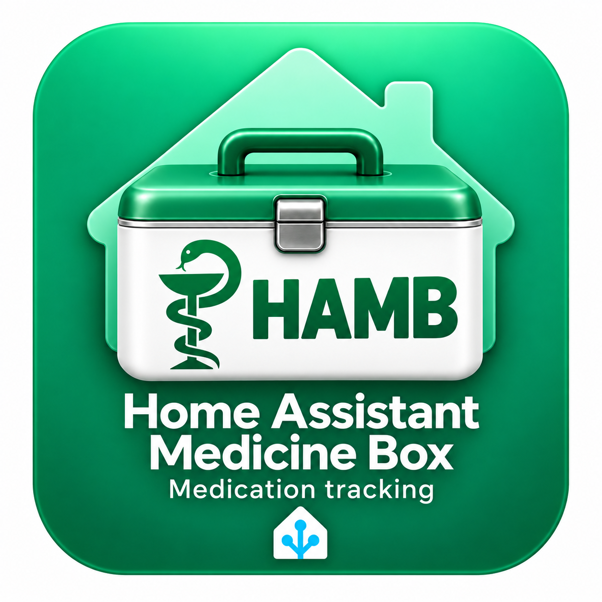

  <strong>English</strong> | <a href="README.ru.md">Русский</a>

<h1 align="center">HAMB — Home Assistant Medicine Box</h1>

  

  <strong>Your medicine cabinet in Home Assistant.</strong> 
  Keep track of your medicines and expiry dates, and get reminders when it is time to replace them. 
  Create separate cabinets for your home, holiday home and car, 
  then download a shopping list as a PDF or CSV before heading to the pharmacy.

## Features

- **Multiple cabinets.** Organize medicines by storage location and switch between cabinets.
- **Individual packages.** Each medicine can have several packages, each with its own expiry date, photos and notes.
- **Stocktake.** Check each package from Settings, correct your selections, and finish at any point. The latest result includes packages you could not find.
- **Multiple packages at once.** Choose a quantity when adding medicine; each package remains separately editable.
- **Compact view.** Switch between expanded cards and a compact list in Settings.
- **Expiry tracking.** See what has expired and what will need replacing within 90 or 7 days. Items without an expiry date can be marked as having no expiry.
- **Reminders.** Receive notifications in Home Assistant and on selected phones.
- **Search and filters.** Find medicines by name or notes, and filter by expiry date and availability.
- **Export.** Download an entire cabinet or selected items as a PDF with photos or a CSV for spreadsheets.
- **Two languages.** The interface, notifications and exports are available in English and Russian. You can also choose your own sidebar title.
- **Local storage.** Records and photos stay on your Home Assistant server.

## Installation

### With HACS

1. Copy this repository's URL.
2. In HACS, open **⋮ → Custom repositories**.
3. Paste the URL and select **Integration** as the type.
4. Search for **HAMB**, then open **HAMB — Home Assistant Medicine Box** and download the integration.
5. Restart Home Assistant, then follow the initial setup steps below.

Learn more: [adding a custom repository to HACS](https://www.hacs.xyz/docs/faq/custom_repositories/).

### Manual installation

1. Download this repository as a ZIP using **Code → Download ZIP**.
2. Extract the archive and copy `custom_components/medicine_cabinet` into your Home Assistant `custom_components` directory. Create that directory if it does not exist.
3. Make sure `manifest.json` is at `/config/custom_components/medicine_cabinet/manifest.json`. Your file editor may show the configuration directory as `/homeassistant`.
4. Restart Home Assistant.

### Initial setup

1. Open **Settings → Devices & services → Add integration**.
2. Search for **HAMB — Home Assistant Medicine Box**.
3. Choose a language: **RUS — Русский** or **EN — English**.
4. Set the sidebar title. The default is **Medicine Box** in English and **Аптечка** in Russian. You can enter a custom title.
5. Open the new sidebar page and create your first cabinet.

## Export and shopping lists

Click **Export**. The dialog title shows which cabinet will be exported. Choose **PDF with photos** or **CSV for spreadsheets**, then select an expiry filter:

- **Expired medicines** — packages that have already expired.
- **Within 90 days, including expired** — packages that have expired or will expire within 90 days.
- **More than 90 days away** — packages with an expiry date beyond that period.
- **All medicines** — any expiry date, including items with no expiry.

The expiry filter selects packages that are in stock. Checking **Include all finished packages** also includes every used-up package in the selected cabinet, regardless of its expiry date.

For example, select **Within 90 days, including expired** and **Include all finished packages** to make a restocking list.

The number of medicines and packages that will be included appears at the bottom of the dialog and updates as you change the filters. The filters in the main medicine list do not affect exports.

By default, the entire cabinet is exported. PDFs include photos and package details; CSV files have one row per package. The downloaded file is saved on your device and can be opened without Home Assistant.

## Data and backups

Records and photos are stored on your server and included in backups of your Home Assistant configuration. Cabinets are shared by all users signed in to that server.

For a manual transfer, keep the records file at `/config/.storage/medicine_cabinet` and the photos directory at `/config/medicine_cabinet/images/`.

Removing the integration from Devices & services preserves your data. You can access it again after adding HAMB back.

## License

The code is released under the [MIT License](LICENSE). The DejaVu fonts are covered by their [own license](custom_components/medicine_cabinet/fonts/LICENSE-DejaVu.txt).
