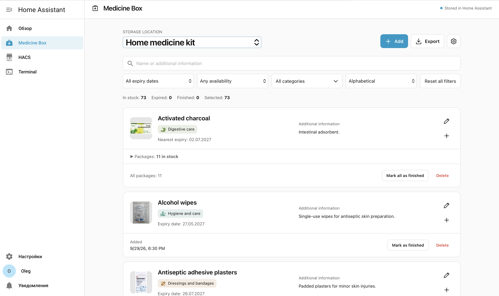
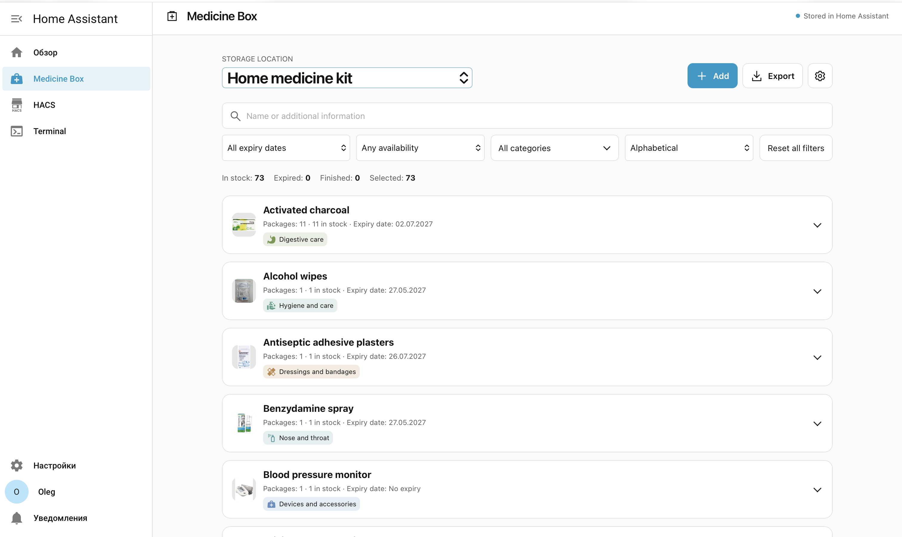
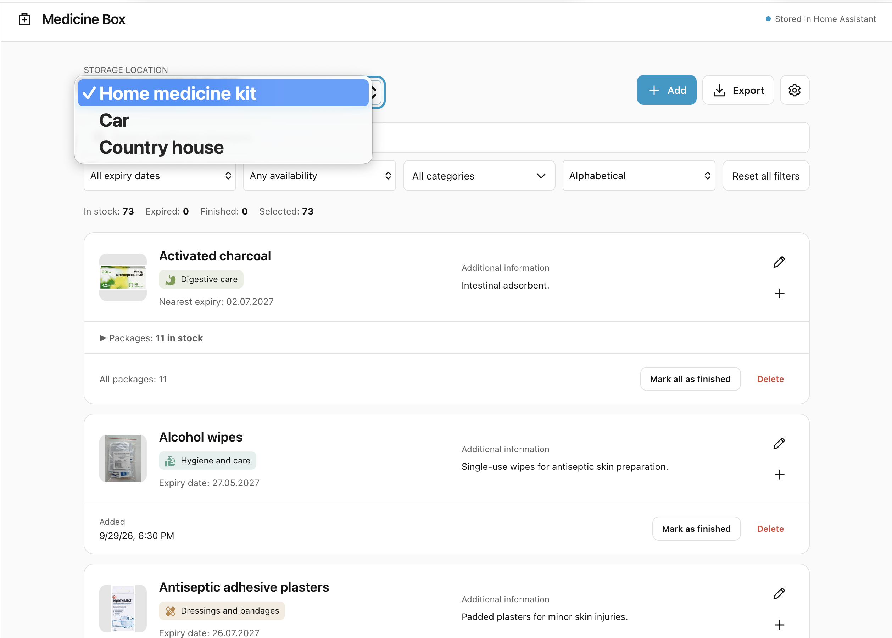
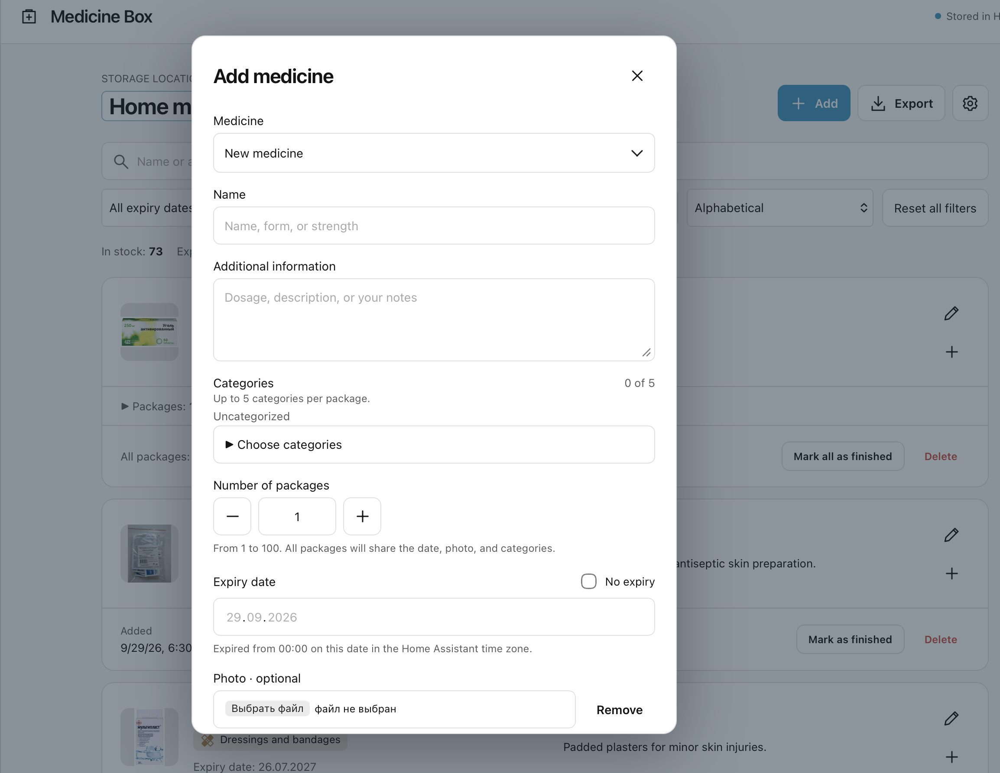
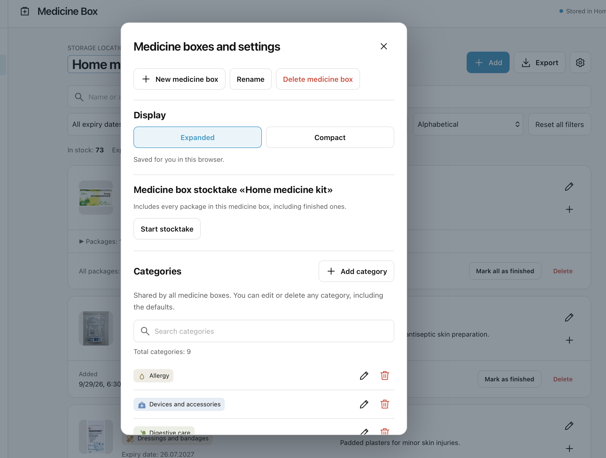
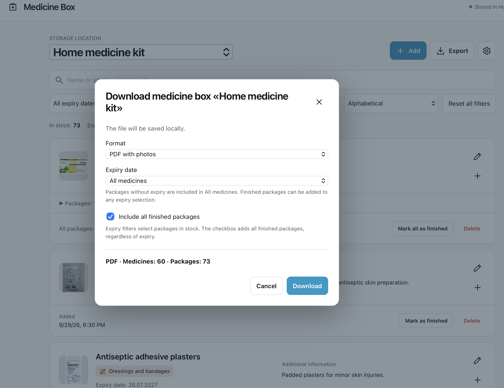
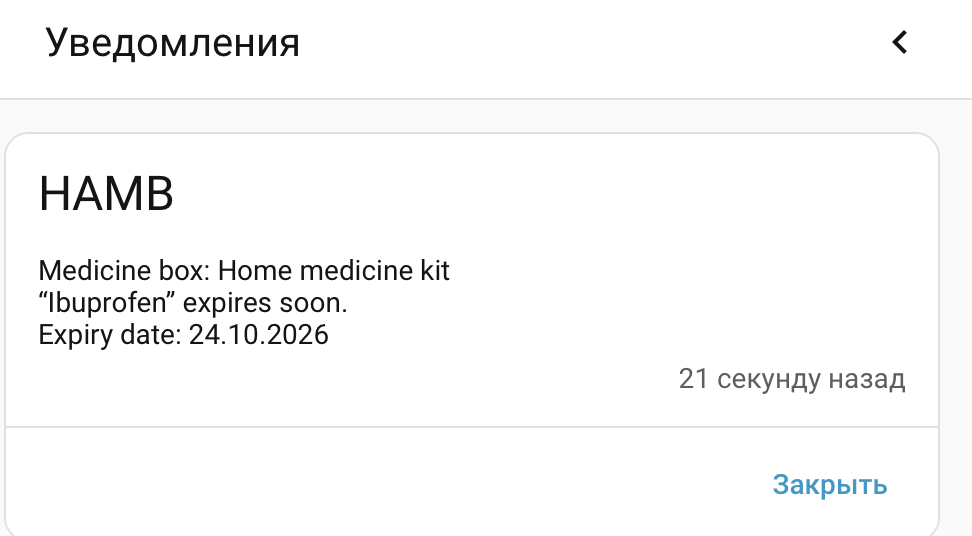
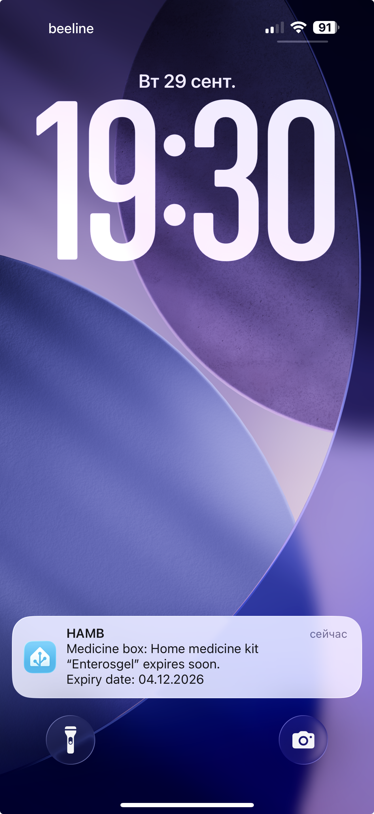

# HAMB in pictures

**English** · [Русский](../ru/examples.md)

[Back to README](../../README.md) · [Choose a language](../README.md)

These screenshots show a populated medicine box and the main things you can do in HAMB.

1. [Medicine list and storage locations](#1-medicine-list-and-storage-locations)
2. [Adding a medicine or more packages](#2-adding-a-medicine-or-more-packages)
3. [Settings and stocktake](#3-settings-and-stocktake)
4. [Exporting to PDF or CSV](#4-exporting-to-pdf-or-csv)
5. [Notifications in Home Assistant and on your phone](#5-notifications-in-home-assistant-and-on-your-phone)

## 1. Medicine list and storage locations

### Expanded view

The main page lists medicines and supplies in the selected medicine box. Each card shows a photo, name, categories, expiry information and any notes. Packages of the same medicine are grouped together: expand **Packages** to see their individual expiry dates and categories.

Categories remain visible when the packages are collapsed. The medicine header shows all categories used by its packages, without duplicates. For example, packages tagged “Children’s kit + Travel kit” and “Children’s kit + Emergency supplies” produce three category labels in the header.

Use the pencil to edit details or **+** to add another package. You can also mark a package as finished when it runs out.

Above the list you can:

- Search by medicine name or additional information.
- Filter by expiry date and availability.
- Open **All categories**, search the category list and select one or several checkboxes. A package is shown if it belongs to any selected category.
- Sort alphabetically or by nearest expiry date, or use **Reset all filters** to return to the full list.

The counters show packages in stock, expired packages, finished packages and the number in the current selection.

### Compact view

Open the gear menu and select **Display → Compact**. The list becomes shorter, while the photo, name, package count, expiry information and category labels stay visible. Expand a row to access its details and actions.

Choose **Expanded** to return to larger cards. The display preference is saved for you in this browser.

### Choosing a medicine box

Use **Storage location** to switch between separate inventories, such as **Home medicine kit**, **Car** and **Country house**. The list and its counters update for the selected box. Create and rename these locations in the gear menu.

## 2. Adding a medicine or more packages

Click **Add** to open the form. Choose **New medicine** to create a new entry, or select an existing medicine to add more packages to its card.

| Field | What to enter |
| --- | --- |
| **Medicine** | A new medicine or an existing entry in the current medicine box. |
| **Name** | The medicine or supply name. Include the form or strength if it helps distinguish entries. |
| **Additional information** | An optional description, dosage notes or other information you want to keep with the package. |
| **Categories** | Up to **5 categories per package**. Select existing ones or create a category with your own name, color and Home Assistant icon. New categories can be reused for other medicines. |
| **Number of packages** | Defaults to **1**. Use **− / +** or type a number from **1 to 100**. |
| **Expiry date** | The date printed on the package, or **No expiry** for items without an expiry date. |
| **Photo** | An optional package photo. You can add or replace it later. |

When you create several packages at once, they start with the same expiry date, photo, notes and categories. Each package can then be edited separately, so different batches can have different expiry dates or category labels.

## 3. Settings and stocktake

Click the **gear** next to Export to open **Medicine boxes and settings**.

### Medicine boxes and display

Create a **New medicine box**, **Rename** the current one, or **Delete medicine box** together with its medicines and packages. The **Display** controls switch between expanded cards and the compact list.

### Stocktake: check what is actually there

A stocktake helps bring the saved inventory up to date with the contents of your physical medicine box. Select the box you want to check, then choose **Start stocktake** in Settings.

All its packages are included, even those previously marked as finished. For each package, choose:

- **Present** — the package is there and should be marked as in stock.
- **Finished / missing** — the package has run out or you cannot find it. Its record is kept and its availability changes to finished.

The selected answer is highlighted. You can change or clear an answer before saving. The finish control stays visible, so you can stop at the beginning, halfway through or after checking every package. Saving applies only the answers you gave; unchecked packages remain unchanged.

### Categories

Categories are shared by all medicine boxes. Add a category in advance, search the list, change its name, color or Home Assistant icon, or delete it. You can remove the default categories too, including all of them if you prefer to keep your inventory uncategorized.

### Language, reminders and storage

Administrators can scroll through Settings to access:

- **Language, sidebar title, and reminders** — open the integration settings to choose English or Russian, customize the sidebar title, set the notification time and select notification destinations.
- **Data and storage** — download a ZIP backup of all medicine boxes and their referenced photos, clean up unused photos, or delete all inventory data and photos after confirmation. Integration settings are not included in the ZIP.

## 4. Exporting to PDF or CSV

Click **Export**. The dialog title shows the medicine box you are downloading, and the counter at the bottom shows how many medicines and packages will be included.

Choose the format:

- **PDF with photos** — a document with medicine photos, categories, expiry dates, availability and descriptions where provided. Empty descriptions and the date a package was added are omitted.
- **CSV for spreadsheets** — one row per package, including its categories and additional information, for opening in a spreadsheet.

The export has its own expiry filter:

| Filter | Packages in stock that it includes |
| --- | --- |
| **Expired medicines** | Packages that have already expired. |
| **Within 90 days, including expired** | Packages already expired or expiring within 90 days. |
| **More than 90 days away** | Packages with an expiry date beyond that period. |
| **All medicines** | All expiry dates, including items marked **No expiry**. |

**Include all finished packages** adds every finished package in this medicine box, regardless of its expiry date. For a restocking list, combine this checkbox with **Within 90 days, including expired**.

The search and filters on the main page do not affect the export. Check the medicine and package counts, then click **Download**. The file is saved on your device and can be opened without Home Assistant.

## 5. Notifications in Home Assistant and on your phone

Expiry reminders identify the medicine box, medicine and expiry date, so you know which item needs attention. Configure delivery in **Settings → Language, sidebar title, and reminders**.

### In Home Assistant

A notification appears in Home Assistant’s notification panel. This example shows an upcoming expiry reminder for **Ibuprofen** in **Home medicine kit**.

### On your phone

With the Home Assistant Companion App connected and the phone selected as a notification destination, the reminder also arrives as a push notification. This example shows **Enterosgel** on an iPhone lock screen.

[Back to README](../../README.md) · [Русская версия](../ru/examples.md)
