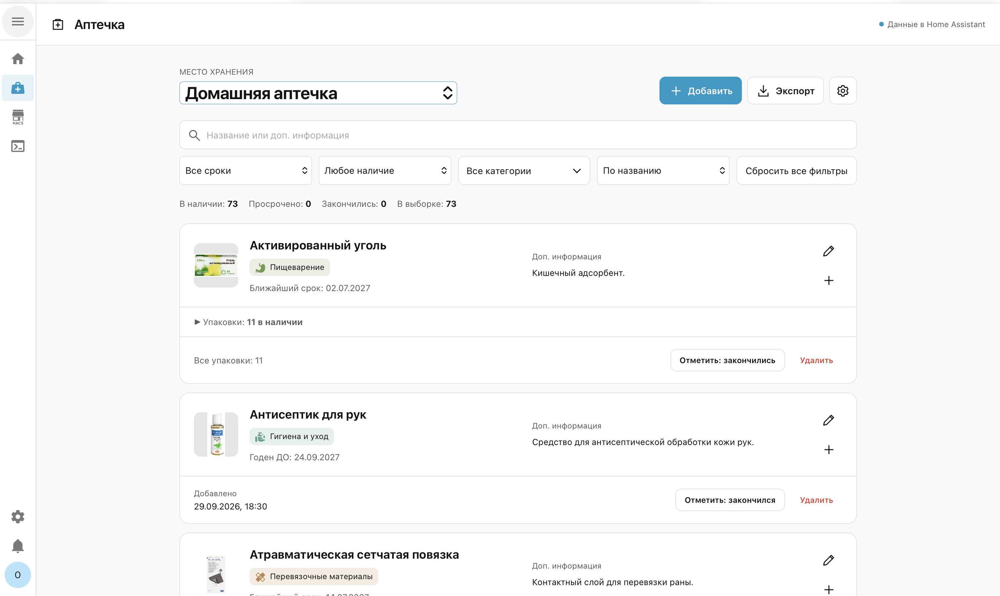
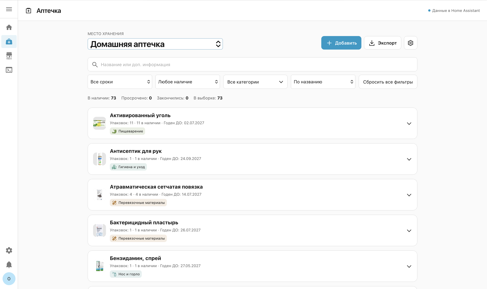
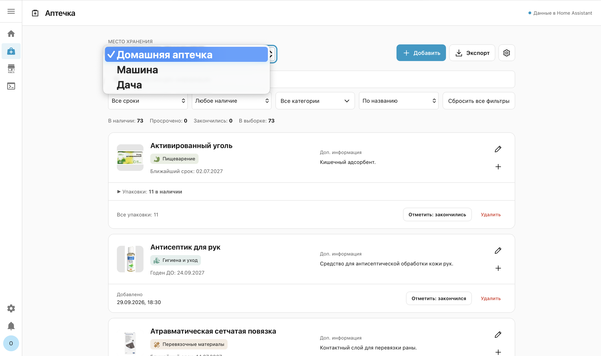
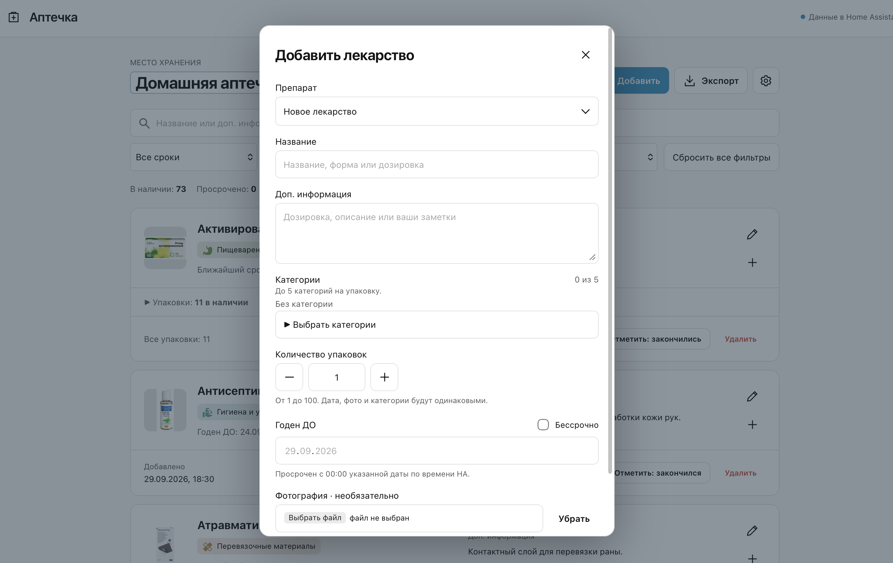
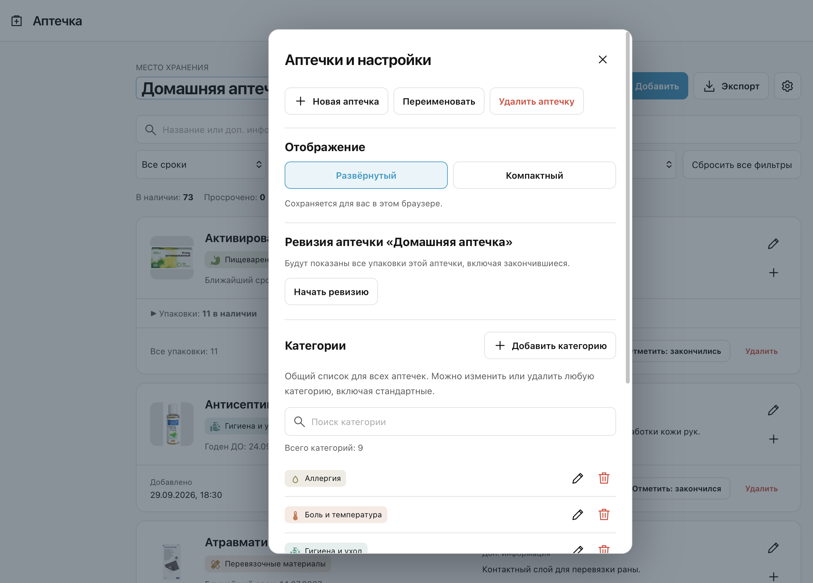
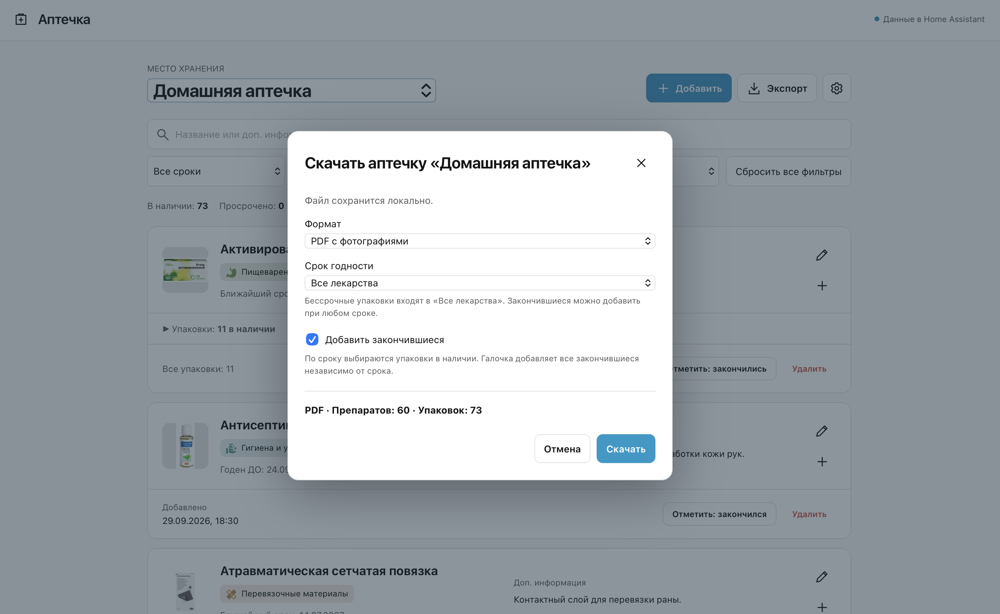
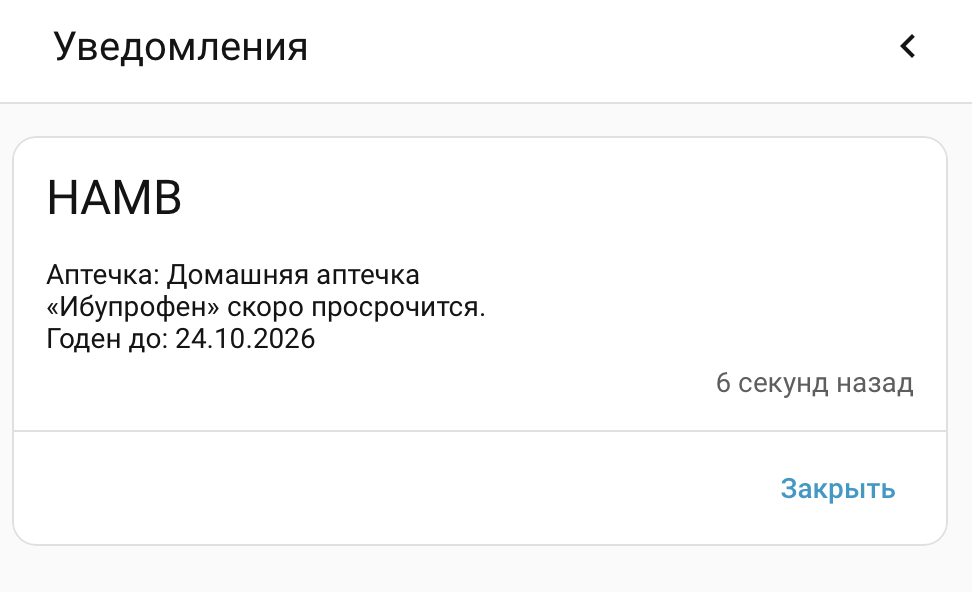
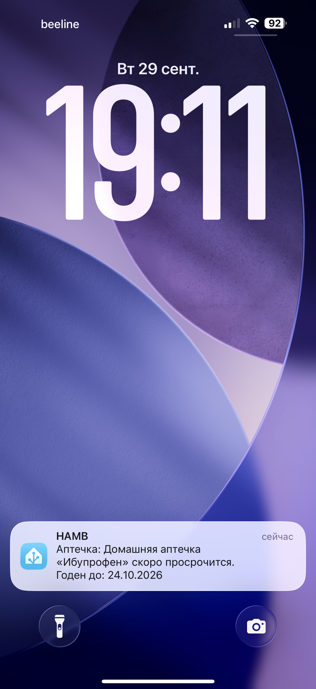

# HAMB в скриншотах

[English](../en/examples.md) · **Русский**

[Вернуться к README](../../README.ru.md) · [Выбрать язык](../README.md)

На скриншотах показан пример заполненной аптечки и основные возможности HAMB.

1. [Список лекарств и выбор аптечки](#1-список-лекарств-и-выбор-аптечки)
2. [Добавление лекарства или новых упаковок](#2-добавление-лекарства-или-новых-упаковок)
3. [Настройки и ревизия](#3-настройки-и-ревизия)
4. [Экспорт в PDF и CSV](#4-экспорт-в-pdf-и-csv)
5. [Уведомления в Home Assistant и на телефоне](#5-уведомления-в-home-assistant-и-на-телефоне)

## 1. Список лекарств и выбор аптечки

### Развёрнутый вид

На главной странице — лекарства и средства из выбранной аптечки. В карточке видны фотография, название, категории, срок годности и дополнительная информация. Упаковки одного препарата собраны вместе: раскройте **Упаковки**, чтобы посмотреть отдельные сроки и категории.

Категории видны и без раскрытия упаковок. В общей карточке собраны все категории вложенных упаковок без повторений. Например, если у одной упаковки выбраны «Детская аптечка + Дорожная аптечка», а у другой — «Детская аптечка + Экстренные средства», сверху будут показаны три категории.

Карандаш открывает редактирование, а **+** добавляет ещё одну упаковку. Когда лекарство закончится, упаковку можно отметить как закончившуюся.

Над списком можно:

- Найти лекарство по названию или дополнительной информации.
- Отобрать упаковки по сроку годности и наличию.
- Открыть **Все категории**, найти нужные категории поиском и отметить одну или несколько галочками. В список попадут упаковки хотя бы с одной из выбранных категорий.
- Отсортировать по названию или ближайшему сроку, а затем вернуться к полному списку кнопкой **Сбросить все фильтры**.

Счётчики показывают количество упаковок в наличии, просроченных, закончившихся и попавших в текущую выборку.

### Компактный режим

Откройте шестерёнку и выберите **Отображение → Компактный**. Список займёт меньше места, при этом фотография, название, количество упаковок, срок и категории останутся видны. Раскройте строку, чтобы перейти к подробностям и действиям.

Кнопка **Развёрнутый** возвращает большие карточки. Выбранный режим сохраняется для вас в этом браузере.

### Выбор аптечки

Поле **Место хранения** переключает отдельные аптечки: например, **Домашняя аптечка**, **Машина** и **Дача**. Список и счётчики обновляются для выбранного места. Создавать и переименовывать аптечки можно через шестерёнку.

## 2. Добавление лекарства или новых упаковок

Нажмите **Добавить**, чтобы открыть форму. Выберите **Новое лекарство** для нового препарата или уже сохранённое название, чтобы добавить упаковки в существующую карточку.

| Поле | Что указать |
| --- | --- |
| **Препарат** | Новое лекарство или существующую позицию из текущей аптечки. |
| **Название** | Название лекарства или средства. Можно добавить форму выпуска и дозировку, чтобы различать позиции. |
| **Доп. информация** | Необязательное описание, сведения о дозировке или свои заметки об упаковке. |
| **Категории** | До **5 категорий на упаковку**. Выберите готовые или создайте свою с названием, цветом и иконкой Home Assistant. Новая категория будет доступна и для других лекарств. |
| **Количество упаковок** | По умолчанию **1**. Используйте **− / +** или введите число от **1 до 100**. |
| **Годен ДО** | Срок с упаковки или отметку **Бессрочно** для средств без срока годности. |
| **Фотография** | Необязательное фото упаковки. Его можно добавить или заменить позже. |

При добавлении нескольких упаковок за раз у них сначала будут одинаковые срок, фотография, заметки и категории. Затем каждую упаковку можно редактировать отдельно: например, указать разные сроки у разных партий или назначить разные категории.

## 3. Настройки и ревизия

Нажмите **шестерёнку** рядом с экспортом, чтобы открыть **Аптечки и настройки**.

### Аптечки и отображение

Здесь можно создать **Новую аптечку**, **Переименовать** текущую или **Удалить аптечку** вместе с её препаратами и упаковками. В разделе **Отображение** выбирается развёрнутый или компактный список.

### Ревизия: сверить список с тем, что есть дома

Ревизия помогает привести сохранённый список в соответствие с содержимым настоящей аптечки. Выберите место хранения, которое хотите проверить, и нажмите **Начать ревизию** в настройках.

В проверку попадут все упаковки этой аптечки, включая ранее закончившиеся. Для каждой выберите:

- **На месте** — упаковка нашлась, её нужно отметить как имеющуюся в наличии.
- **Закончилось / отсутствует** — лекарство закончилось или упаковка не найдена. Запись сохранится, а наличие изменится на «закончилось».

Выбранный ответ подсвечивается. До сохранения его можно изменить или снять. Кнопка завершения остаётся в поле видимости: закончить ревизию можно в начале, на середине или после проверки всех упаковок. При сохранении применяются только сделанные отметки; непроверенные упаковки не меняются.

### Категории

Категории общие для всех аптечек. Можно заранее добавить свою, найти нужную поиском, изменить её название, цвет или иконку Home Assistant либо удалить. Стандартные категории тоже можно удалять — вплоть до пустого списка, если хотите вести аптечку без категорий.

### Язык, уведомления и хранение данных

Прокрутив настройки, администратор найдёт дополнительные пункты:

- **Язык, название и уведомления** — переход к настройкам интеграции: русский или английский язык, своё название в боковом меню, время отправки напоминаний и получатели.
- **Данные и хранилища** — ZIP-копия всех аптечек с используемыми фотографиями, очистка неиспользуемых фото или удаление всех данных и фотографий после подтверждения. Настройки интеграции в ZIP не входят.

## 4. Экспорт в PDF и CSV

Нажмите **Экспорт**. В заголовке окна указана аптечка, которую вы скачиваете, а внизу — сколько препаратов и упаковок попадёт в файл.

Выберите формат:

- **PDF с фотографиями** — документ с фото, категориями, сроками годности, наличием и описаниями, если они заполнены. Пустые описания и дата добавления упаковки не выводятся.
- **CSV для таблиц** — отдельная строка для каждой упаковки, включая категории и дополнительную информацию, для работы в табличном редакторе.

У экспорта свой фильтр по сроку годности:

| Фильтр | Какие упаковки в наличии попадут в файл |
| --- | --- |
| **Просроченные** | Упаковки, срок которых уже истёк. |
| **До 90 дней, включая просроченные** | Уже просроченные и те, что станут просроченными в течение 90 дней. |
| **Более чем через 90 дней** | Упаковки с датой истечения позже этого периода. |
| **Все лекарства** | Любые сроки, включая позиции с отметкой **Бессрочно**. |

Галочка **Добавить закончившиеся** включает все закончившиеся упаковки этой аптечки независимо от срока. Для списка покупок удобно совместить её с фильтром **До 90 дней, включая просроченные**.

Поиск и фильтры на главной странице на экспорт не влияют. Проверьте количество препаратов и упаковок, затем нажмите **Скачать**. Файл сохранится на устройстве и будет открываться без Home Assistant.

## 5. Уведомления в Home Assistant и на телефоне

В напоминании указаны аптечка, препарат и срок годности — понятно, какую позицию нужно проверить. Доставка настраивается через **Шестерёнка → Язык, название и уведомления**.

### В Home Assistant

Напоминание появляется в панели уведомлений Home Assistant. На примере — приближающийся срок годности **Ибупрофена** в **Домашней аптечке**.

### На телефоне

Если телефон подключён через Home Assistant Companion App и выбран получателем, напоминание также приходит как push-уведомление. На примере — **Ибупрофен** на экране блокировки iPhone.

[Вернуться к README](../../README.ru.md) · [English version](../en/examples.md)
